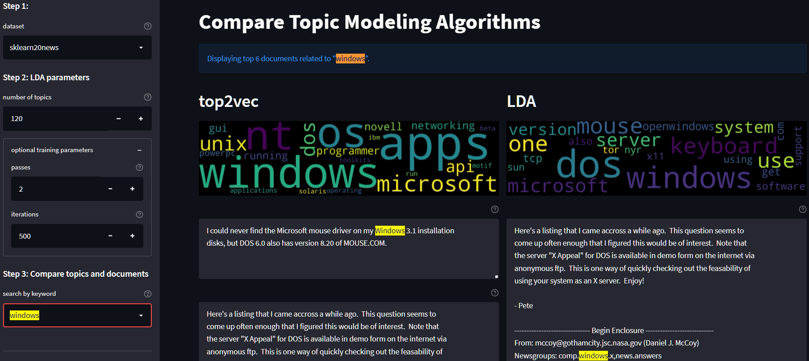

# CourseProject 

The goal of this project is to develop a means of easily comparing various topic modeling methods, such as [LDA](https://www.jmlr.org/papers/volume3/blei03a/blei03a.pdf) and [Top2Vec](https://arxiv.org/abs/2008.09470).  
This was implemented through a [Streamlit](https://streamlit.io) web app hosted [here](https://share.streamlit.io/wujameszj/courseproject/main/main.py).  
A demo video is available [here]().

## Install

The online web app has limited CPU and RAM resources.  
For heavy testing, it is recommended to run this app locally.  

1. Create a new conda env, preferably with python=3.8 for compatibility
1. Clone this repo and switch to project directory
1. Install dependencies `pip install -r requirements.txt`
1. Launch app in browser via `streamlit run main.py`  

## Implementation

The app has two components: 
1. a sidebar for user input and control parameters; and 
2. the main pane which displays the result of various topic modeling algorithms.

In the main pane, each algorithm has a dedicated column for displaying its results.  The columns are lined up side-by-side for ease of comparison.  
The topics produced by the algorithms are shown via wordclouds, where word size corresponds to term weight.  The documents returned by a keyword search are displayed in height-adjustable text boxes below the wordclouds.

[] (https://radimrehurek.com/gensim/auto_examples/tutorials/run_lda.html)

(https://github.com/ddangelov/Top2Vec)[

## Future work

- expand available datasets for testing
- phrase/multi-term search
- more parameters for fine-tuning models
- add options for lemmatization and word n-grams in vocabulary
- add more algorithms for comparison
- offer customizable result display:
  - number of documents to show
  - default height of document display box
  - number of wordclouds
  - number of words per wordcloud
